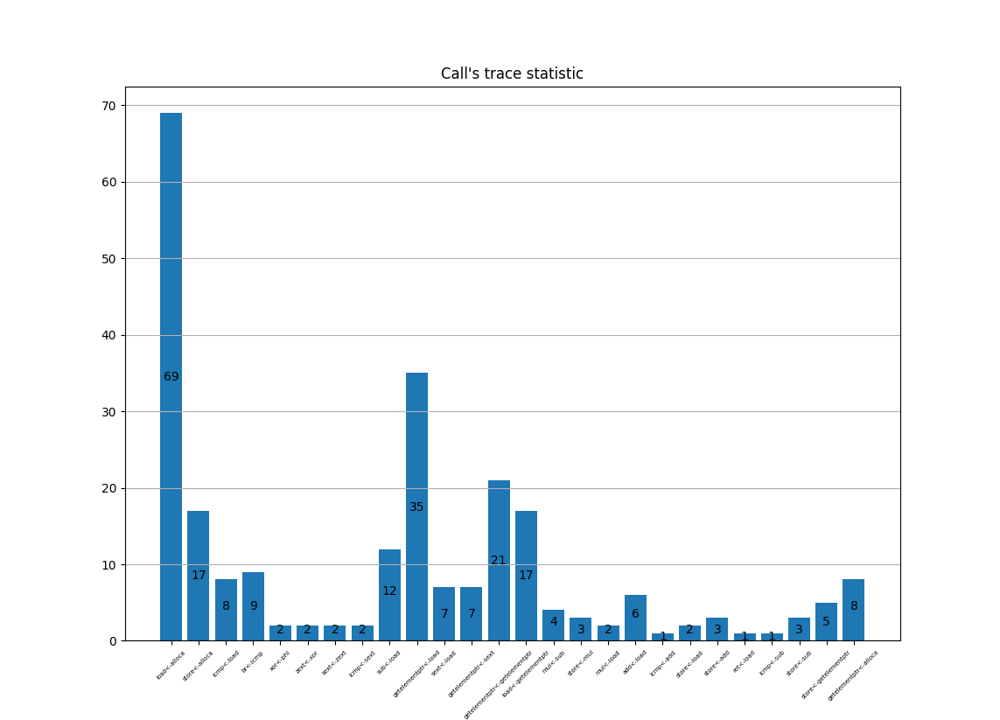

# Trace Collection

## Custom Pass

Implemented llvm pass which prints names of Users' Instructions. Based on it, statistic presented with user <- use enteries numbers

## Usage

```bash
python3 statistic.py
Please enter module name you want statistic for: app.c (press enter)
```

## Result

