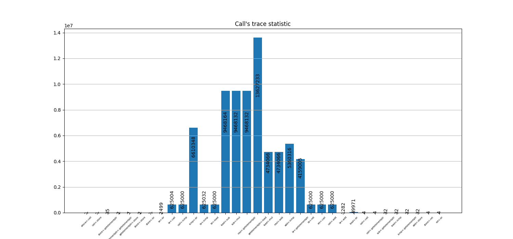

# Trace Collection

## Custom Pass

Implemented llvm pass which prints names of Users' Instructions. Based on it, statistic presented with user <- use enteries numbers

## Build

To collect statistic only for specific module, app. in our case, we need build app.o first with loaded plugin

```bash
clang -c -O2 -fpass-plugin=./my_pass.so `$SDL --cflags` ../app/app.c 
```

Then build applicatin with linking app.o as normal:

```bash
clang -O2 app.o log.c ../app/main.c ../app/sim.c  $CPPFLAGS $LDFLAGS `$SDL --cflags --libs` -o app
```

## Usage

```bash
python3 statistic.py win_size
```

## Result

### Window size=1


### Window size=2

